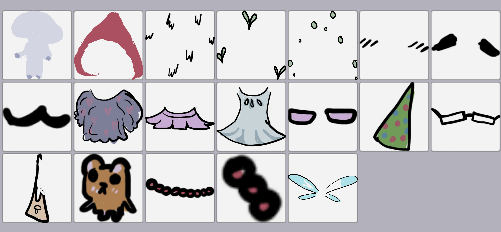
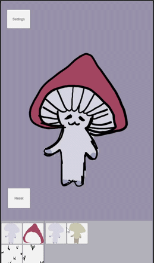

# Mushroomsona 🍄
## Casual 2D Character Customization Prototype (Android)
___
### Overview
Mushroomsona is a casual 2D dress-up/customization game prototype where the player creates cute mushroom looks by combining different body parts and accessories.

The project includes a fully functional dress-up core loop with a flexible structure designed to be easy to extend.

The focus of the project is to demonstrate experience with UI-oriented gameplay systems built using an MVC architecture.
___
### Teach Stack
* Engine: Unity
* Language: C#
* Platform: Mobile devices (Android)
* Architecture: MVC
* Rendering: URP
* Optimization: Object Pooling
* UI: UGUI | Scroll Rect, Mask, Content Size Filter
* State Management: Persistent data holder | Singleton for prototype scope
* Data Configuration: ScriptableObjects
* Reusable Content: Prefabs
* Version Control: Git
___
### Gameplay Overview
The main goal of the game is to encourage the player’s creativity by customizing a cute mushroom character through selecting different visual parts. The customization is organized into the following categories:
* Body Color
* Head Color
* Body Feature
* Head Feature
* Head Dots
* Face Feature
* Eyes
* Mouth
* Upper Body Cloth
* Lower Body Cloth
* Full Body Cloth
* Shoes
* Head Dress
* Glasses
* Bag
* Item
* Necklace
* Bracelet
* Wings

The list of items within each category can be easily expanded by adding new options, and new categories can be introduced as well. The project architecture is designed to support this kind of scalability with minimal effort.
___
### Core Gameplay Loop
* The player scrolls and selects the desired category.
* In the desired category, the player selects an element that they consider aesthetically suitable for the character look they want to create.
* The element is immediately displayed on the character.
* The player goes through all categories and selects the necessary elements, creating a unique and interesting look.
* If the player wants to remove a specific element, they click on it again.
* If the player wants to reset all changes, they press the Reset button, and the character returns to its default state so a new look can be created again.

___
### Architectural Overview
// Writing in progress

Майбутні зміни
Оновлення текстур з тестових на production
Додати Фото Сцени для збереження фотографії результату з можливістю додавати фон
Додавання функції перегляду реклами для одноразового використання унікального предмета та придбання унікальних предметів за донат